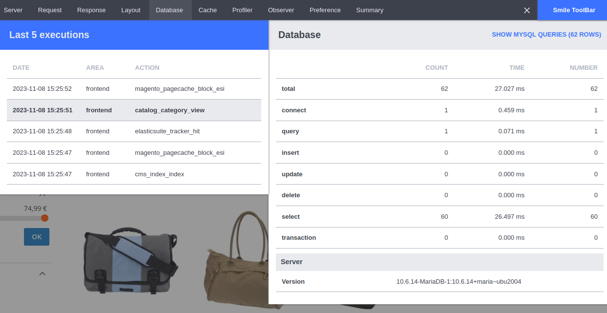

# Smile Debug Toolbar for Magento 2

## Description

This module adds a Debug Toolbar in Magento 2.
The toolbar displays useful information about the last executions (including ajax requests, rest API and graphql):

- HTTP Request/response
- SQL queries (with the PHP trace for each query)
- Profiler information (with timers)
- Layout information
- Cached items
- Plugins/observers that were triggered



## Installation

To install the module:

1. Execute the following command at the root of the Magento installation:
    ```bash
    composer require --dev smile/module-debug-toolbar
    ```
2. Enable the module:
    ```bash
    bin/magento module:enable Smile_DebugToolbar
    bin/magento setup:upgrade
    ```
3. Enable the toolbar:
    ```
    bin/magento config:set smile_debugtoolbar/configuration/enabled 1
    ```

## Configuration

The configuration of the module is available in the section **Smile > Smile DebugToolbar** of the admin area:

You can:

- Enable / disable the debug toolbar (default: disabled)
- Show / hide the debug toolbar in the admin area (default: hidden)
- Choose the number of last executions to save and display in the toolbar (default: 5)

## Uninstallation

Unfortunately, the module cannot be automatically uninstalled, because Magento doesn't support uninstallation of dev packages out of the box.

To uninstall the module, follow these steps:

1. In app/etc/env.php, remove the key `db.connection.default.profiler` from the array if it is defined.
2. Run the following commands:
    ```
    bin/magento module:disable Smile_DebugToolbar
    composer remove --dev smile/module-debug-toolbar
    bin/magento setup:upgrade
    ```
3. [Optional] Remove the directory "var/smile_toolbar".

## Customizing the Toolbar

It is possible to add new zones to the toolbar (e.g. to display project-specific data).
This is [documented here](doc/add-zone.md).

## Contributing

You can contribute to this module by submitting issues or pull requests.

For more details, please take a look at the [contribution guidelines](CONTRIBUTING.md).

## License

This module is licensed under the [Eclipse Public License - v 2.0](LICENSE.md).

## Changelog

All notable changes are recorded in this [changelog](CHANGELOG.md).

## Contact

Smile Technical Office <dirtech@smile.fr>
