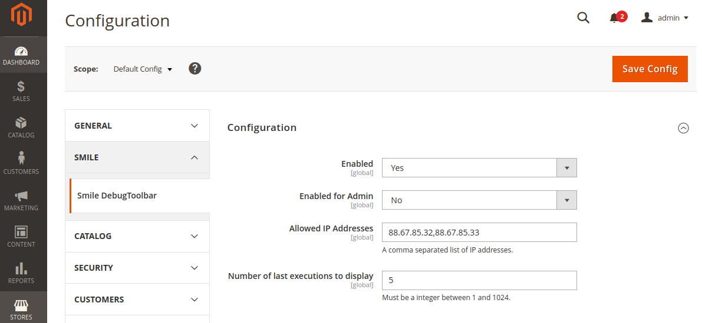

# Smile Debug Toolbar for Magento 2

[Back](README.md)

## Back-Office

### ACL

A new specific resource ACL **Smile_DebugToolbar::config** has been added.

You must have this ACL if you want to modify the Smile Debug Toolbar configuration.

This ACL is in the following path :

* Magento_Backend::admin (Admin)
* Magento_Backend::stores (Stores)
* Magento_Backend::stores_settings (Settings)
* Magento_Config::config (Configuration)
* Smile_DebugToolbar::config (Smile DebugToolbar Section)

### Configuration

A new configuration section **Smile > Smile DebugToolbar** has been added.

You can:

* Enable / Disable the Debug Toolbar
* Chose the number of last executions to save and display in the toolbar

[Back](README.md)
