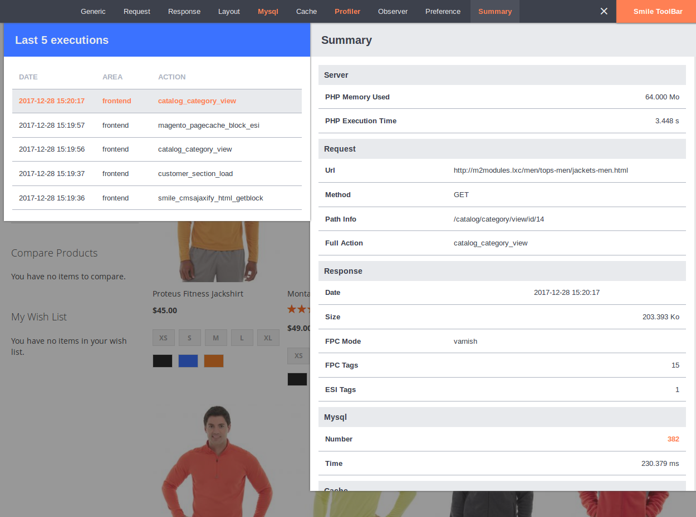
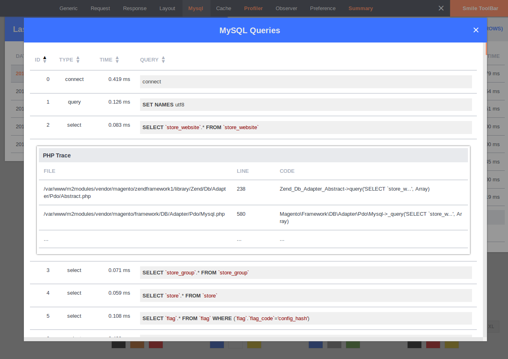

# Toolbar

## Access

On the top of the page, you will see the **Smile ToolBar** button.

You can click on it to display the Toolbar:

If the button is **blue**, it means that there is no warning during the current execution.

If the button is **orange**, it means that there is at least one warning during the current execution:

## Navigator

On the left, you can see the navigator.

It allows you to navigate into the last X executions.

You can analyse every ajax call, esi block, ...

If an execution has a warning, its line will be **orange**. 

## Zones

The following zones are available:

* Generic
* Request
* Response
* Layout
* Mysql
* Cache
* Profiler
* Observer
* Preferences
* Summary

You can click on each zone label to see the concerned information.

If a zone is **orange**, it means that there is at least one warning in it.

The value in warning will be in **orange**:

In some zones, you can display additional information, by clicking on the links **Show xxx (xx rows)** on the top of the zone.

it will display a popin with a sortable table.

On some tables, you can click on the row to display additional information.
For example, in the **mysql queries tables**, you can display the php trace: 

[Back](../README.md)
